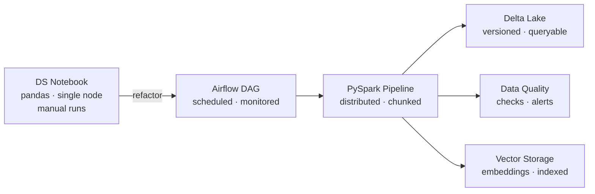

A Data Scientist's notebook optimised for exploratory work on a small sample will often need significant rework before it can run reliably at production scale. This reflects a natural difference in priorities between DE and DS: notebooks favour iteration speed, while production pipelines prioritise reliability, scalability, and cost efficiency. Bridging that gap requires both disciplines to have a working understanding of each other's constraints.

Recently, I partnered with Data Scientists to scale a Semantic Search and Theming application from an exploratory notebook to a production data pipeline. This post describes the journey — what I had to learn, what we had to align on, and how the code evolved from an experimental notebook to a production pipeline.

---

## Table of contents

- [Learning Data Science concepts](#learning-data-science-concepts)
- [Understanding business value](#understanding-business-value)
- [What the Data Scientist needed vs. what production required](#what-the-data-scientist-needed-vs-what-production-required)
- [Features and scalability](#features-and-scalability)
- [API reliability](#api-reliability)
- [Conclusion](#conclusion)

---

## Learning Data Science concepts

Over the past few years, Data Engineering's primary use case has evolved from pure analytics — for technical and business decision makers — to a combination of analytics and machine learning model support for Data Scientists and data analysts.

This shift requires a Data Engineer to gain a deep understanding about what they are building. For semantic search and theming specifically, the questions I needed to answer before I could contribute meaningfully were:

- What does semantic search actually do, and how is it different from 
  keyword search?
- What is an embedding, and why does chunking large text documents 
  before embedding matter?
- What is the difference between cosine similarity and dot product 
  search, and what does that mean for how you store and query vectors?
- Which embedding models are appropriate for the kinds of text being 
  processed?

These are not questions a Data Engineer needs to answer at a research level. But understanding them well enough to make architecture decisions — which vector storage to use, how to design a chunking pipeline, what is the right compute type for generating embeddings at scale — is the prerequisite to ensure that the application works as intended for the user count and data volume in production.

A Data Engineer's job in this collaboration is to educate Data Scientists on the nuances of production data engineering with regards to their use cases, agree on trade-offs and roadmap priorities together, and build the infrastructure that will scale their Search and Theming logic.

---

## Understanding business value

Before any technical work, both Data Engineers and Data Scientists need alignment on three questions:

- Who are the customers, and what are they trying to do with the data?
- What problem are we actually solving — not just technologically, but the business value for the customers? 
- What does "good enough" look like for the first version?

Once we had answers to the above questions, we used it to formulate a problem statement. A closer look at the problem statement often reveals that it can be decomposed into smaller, prioritised use cases with clearer success criteria. Getting frequent and early feedback from both Data Scientists and business users — before the pipeline is complete — prevents the risk of building something that no one might be using in the future. 

Additionally, it is also possible that there are other users or teams trying to solve the same set of problems (technologically) or to unlock the same kinds of business value as us. Identifying such users or teams, collaborating with them to learn and share lessons and also to reduce redundancies and overlaps to promote reusability is a valuable exercise for an organization.

For semantic search and theming, the business question was: can a user describe what they are looking for in natural language and get relevant and accurate results back, without needing to know the exact terminology used in the underlying data?

---

## What the Data Scientist needed vs. what production required

| Concern | Data Scientist's view | Data Engineer's view |
|---|---|---|
| **Data volume** | Sample dataset or a subset of production data volumes, fast iteration | Full historical load, chunked by date or attribute |
| **Compute** | Single-node pandas, local notebook | Distributed Spark, managed cluster |
| **Output** | `print()` / visual inspection | Delta writes, data quality checks |
| **Scheduling** | Manual runs | Airflow DAG with retries and backoff |
| **API calls** | Single attempt, fail fast | Retry logic, exponential backoff, result validation |
| **Reproducibility** | "It worked on my machine" | Versioned Delta tables, tracked runs |
| **Failure handling** | Exception visible in notebook | Alerting, dead-letter queues, pipeline resumability |

---

## Features and scalability

### The standard pipeline structure

For any production data pipeline — whether analytics or ML — these considerations are relevant:

1. **Ingest** data at an agreed latency (batch, micro-batch, or streaming)
2. **Transform** data to meet the use case's needs
3. **Load** into appropriate storage with read/write optimisation
4. **Validate** data quality at multiple points in the pipeline

For ML pipelines, a fifth step applies: **serve** — making the output (embeddings, features, model outputs) available to downstream consumers reliably and at low latency.

### The notebook-to-pipeline gap

When a Data Scientist's notebook becomes a production workload, the following changes are almost always required:

**pandas → Spark**

The most common refactor. pandas operates on a single node. As data volume scales, this becomes a compute bottleneck. The refactor requires replacing pandas operations with Spark DataFrame equivalents and registering Python functions as UDFs for operations that cannot be expressed natively.

Notebook-style, single-node:

```python
import pandas as pd

df = pd.read_csv("dataset.csv")
results = df[df["category"] == "billing"]["description"].apply(embed_text)
print(results.head())
```

Production-ready, Spark:

```python
from pyspark.sql import functions as F
from pyspark.sql.types import ArrayType, FloatType

@udf(returnType=ArrayType(FloatType()))
def embed_text_udf(text: str):
    return embed_text(text)

df = (
    spark.table("dataset")
    .filter(F.col("category") == "billing")
    .withColumn("embedding", embed_text_udf(F.col("description")))
)

# Write directly — never collect() in production
df.write.format("delta").mode("overwrite").save("/mnt/embeddings/billing")
```

Two things to note in the production version: the UDF wraps the embedding function so it runs distributed across the cluster, and the result is written directly to Delta Lake rather than collected to the driver. Collecting a large embedding dataset to the Spark driver is one of the most common causes of out-of-memory failures in production.

**Removing or converting print/display/show statements**

Every `print()`, `display()`, or `show()` call in a Spark context collects data to the driver. In a notebook, this is fine — the dataset is small. In production, it is expensive and in some cases causes driver OOM errors.

Replace with logging:

```python
import logging

logger = logging.getLogger(__name__)

# Instead of: print(df.count())
row_count = df.count()
logger.info(f"Processed {row_count} records in embedding pipeline")

# Instead of: df.show()
# Log a pre-calculated summary, not the raw data
logger.info(f"Embedding pipeline complete. Sample schema: {df.schema}")
```

Logging statements should display pre-calculated results or perform minimal actions on DataFrames. Avoid triggering new Spark actions inside logging calls.

**Data chunking**

As data volumes grow, processing everything in a single run becomes impractical — both for compute cost and for pipeline resumability. Chunk by date or another appropriate attribute:

```python
from datetime import date, timedelta

def get_date_chunks(start_date: date, end_date: date, chunk_days: int = 7):
    current = start_date
    while current < end_date:
        chunk_end = min(current + timedelta(days=chunk_days), end_date)
        yield current, chunk_end
        current = chunk_end

for chunk_start, chunk_end in get_date_chunks(start_date, end_date):
    chunk_df = (
        spark.table("dataset")
        .filter(
            (F.col("created_date") >= chunk_start) &
            (F.col("created_date") < chunk_end)
        )
    )
    process_and_write(chunk_df, chunk_start, chunk_end)
```

Chunking also makes pipeline failures recoverable — a failed chunk can be reprocessed without rerunning the entire historical load.

**Statistics and profiling**

Data profiling operations — row counts, null checks, distribution summaries — are useful during development but expensive at scale. Make them optional or conditional:

```python
ENABLE_PROFILING = False  # set via config or environment variable

if ENABLE_PROFILING:
    logger.info(f"Null count in description: {df.filter(F.col('description').isNull()).count()}")
    logger.info(f"Category distribution: {df.groupBy('category').count().collect()}")
```

---

## API reliability

ML pipelines typically call external APIs — embedding model endpoints, LLM APIs, enrichment services. Notebooks call these once per cell and fail fast. Production pipelines need to handle transient failures gracefully.

Implement retries with exponential backoff and explicit handling for rate limit responses:

```python
import time
import requests
from requests.adapters import HTTPAdapter
from urllib3.util.retry import Retry

def get_session_with_retries(
    retries: int = 3,
    backoff_factor: float = 2.0,
    statuses: tuple = (429, 500, 502, 503, 504),
) -> requests.Session:
    session = requests.Session()
    retry = Retry(
        total=retries,
        backoff_factor=backoff_factor,
        status_forcelist=statuses,
        respect_retry_after_header=True,  # honours 429 Retry-After headers
    )
    adapter = HTTPAdapter(max_retries=retry)
    session.mount("https://", adapter)
    return session


def embedding_api(text: str, session: requests.Session) -> list[float]:
    response = session.post(
        "https://your-embedding-endpoint/embed",
        json={"text": text},
        timeout=30,
    )
    response.raise_for_status()
    result = response.json()

    # Validate result structure before returning
    if "embedding" not in result or not isinstance(result["embedding"], list):
        raise ValueError(f"Unexpected API response structure: {result.keys()}")

    return result["embedding"]
```

Two details worth calling out: `respect_retry_after_header=True` honours the `Retry-After` header that rate-limited APIs return (common with OpenAI, Anthropic, and most embedding endpoints), and the result validation after `raise_for_status()` catches cases where the API returns 200 with malformed output — which happens more often than it should in production.

---

## The pipeline architecture

The journey from notebook to production pipeline follows a consistent path:



The collaboration between Data Engineers and Data Scientists is iterative — not a single handoff. Data Scientists validate that the refactored pipeline produces the same results as the notebook. Data Engineers validate that the pipeline meets production reliability and cost requirements. Several iterations are normal before both criteria are satisfied simultaneously.

---

## Conclusion

The hardest part of productionising a Data Science application is not the technical refactoring — it is the alignment on what "production-ready" means between the two disciplines that have different definitions of the term.

For a Data Scientist, production-ready means the model works correctly. For a Data Engineer, production-ready means the 
pipeline runs reliably at scale, fails gracefully, and can be maintained by someone other than the person who built it. 
Both definitions are correct. Getting to a version that satisfies both requires trade-offs and some rounds of discussions — the table in this post is a useful starting point for that conversation.

Data Engineers and Data Scientists solve complementary problems. The notebook provides the logic and the validated approach. The production pipeline provides the infrastructure that makes that approach work at scale. Neither is complete without the other.
